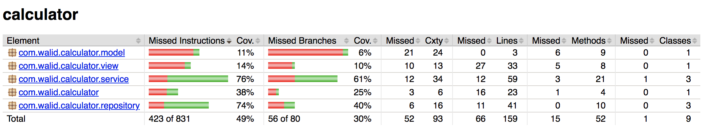
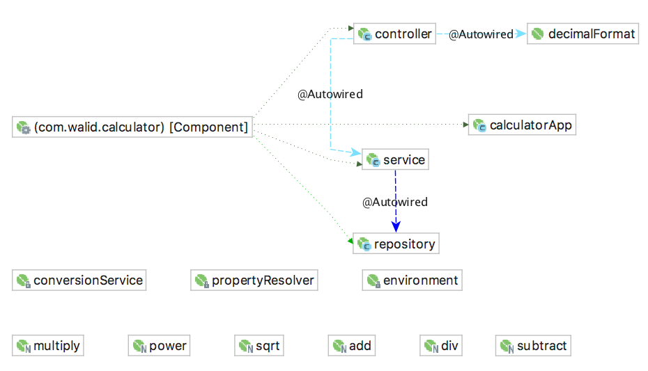

# Spring MVC Reverse Notation Calculator

## Overview
This is a Spring implementation of an RPN (reverse polish notation) calculator structured as modular MVC and 
supported mathematical operations are configurable from an external XML application context file without any need to 
recompile the uber (fat) JAR.

## Main Features
- Supported math operations can be extended from external application context `./calculatorAppContext.xml`
and loaded on the fly (without recompiling the uber JAR).
- Operational journal (log) to support unlimited UNDO operations.

## Main Design Decisions
- MVC modular design using Spring framework.
- Maven used to manage dependen ies and generate the uber JAR.
- JaCoCo used to measure and generate test coverage report.
- SLF4J/Log4j used to append run log to log file `./calculator.log`
- Junit/Hamcrest used to create Unit/Integration tests.
- Lombok library used to auto-generate boilerplate code.

## Synopsis
```bash
$ ls
calculator-1.0.0-spring-uber.jar        calculatorAppContext.xml
$ java -jar calculator-1.0.0-spring-uber.jar
CalculatorApp: Welcome to Reverse Calculator. When finished, enter 'q' to quit.
>> 5 2
stack: 5 2
>> clear
stack: 
>> 2 sqrt
stack: 1.4142135624
>> clear 9 sqrt
stack: 3
>> clear
stack: 
>> 5 4 3 2
stack: 5 4 3 2
>> undo undo *
stack: 20
>> 5 *
stack: 100
>> undo
stack: 20 5
>> clear
stack: 
>> 7 12 2 /
stack: 7 6
>> *
stack: 42
>> 4 /
stack: 10.5
>> clear
stack: 
>> 1 2 3 4 5 *
stack: 1 2 3 20
>> 3 4 -
stack: 1 2 3 20 -1
>> clear
stack: 
>> 1 2 3 4 5
stack: 1 2 3 4 5
>> * * * *
stack: 120
>> clear
stack: 
>> 1 2 3 * 5 + * * 6 5
ERROR: CalculatorController: Processing of input line stopped due to error processing token "*" (at index 8)
stack: 11
>> q
CalculatorApp: Bye!
$
```

## Test Coverage Report

jaCoCoTestCoverageReport

## Architecture
